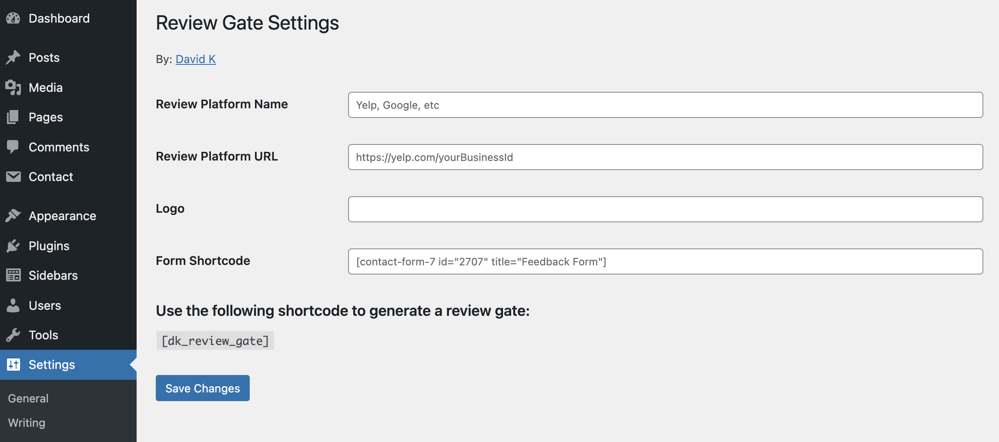

# WordPress Review Gate Plugin

Packaged the [jQuery library](https://github.com/davidkim10/jquery-review-gate) I created and turned it into a WordPress plugin :)

## Plugin Description

Review gate made with jQuery to capture user reviews that are not 5-star quality. This helps businesses collect both negative and positive feedback to better enhance their customer service experience.

The screenshot(s) below use a fake/pseudo company to illustrate the review gate.

## Quick Start

### HTML Markup Used in Plugin

```html
<div class="dk-review-gate-wrapper">
    <nav class="review-gate-navbar" style="display: none">
    <button class="review-gate-navbar__btn">&#10094;</button>
    <div class="review-gate-navbar__logo-wrapper">
        
    </div>
    </nav>
    <div id="review-gate">
    <section class="review-step">
        <h2 class="review-title">Rate Your Recent Experience</h2>
    </section>
    <section class="review-step">
        <h2 class="review-title">Please Leave Us A Review!</h2>
        <p>
        We are very happy to hear you had a positive experience with $company. Please take a second to leave us
        a review on $platform.
        </p>
        <a class="btn btn-color-primary btn-style-default btn-size-default leave-review-btn" href="$link">Leave
        Review</a>
    </section>
    <section class="review-step">
        <h2 class="review-title">Please Leave Us Some Feedback</h2>
        <p>
        We are sorry to hear you did not have a 5-Star experience. Please
        take a moment to leave us feedback on how we can improve.
        <br />
        <br />
        $form_shortcode
        </p>
    </section>
    </div>
</div>
```

### Initilaize the Review Gate

The plugin will not automatically initialize the JS code. It is important to include the snippet below wherever you use the shortcode provided by the plugin.

```javascript
var config = {
  navbarColor: '#0f18e9',
  onUpdate: function (count) {
    if (count >= 5) {
      // Do something on good review
      $('#review-gate').reviewGate('step', 2);
    } else {
      // Do something on bad review
      $('#review-gate').reviewGate('step', 3);
    }
  },
};

$(document).ready(function () {
  $('#review-gate').reviewGate(config);
});
```

## Default Configs

If you do not specify a config object when you initialize the review gate the following will be used:

```javascript
var defaults = {
  stepClassName: 'review-step',
  navbarColor: '#fff',
  navBarClassName: 'review-gate-navbar',
  navBarBackBtnClassName: 'review-gate-navbar__btn',
  enableNavBackBtn: true,
  emojiConfig: {
    emoji: 'star',
    fontSize: 42,
    attributes: {
      id: 'emoji-ratings-wrapper',
      // You can spread additional HTML attributes to your emoji element wrapper.
      // By default, only an ID attribute is used.
    },
    css: {},
  },
  onUpdate: function () {
    alert('Add an onUpdate function');
  },
};
```

| Property               | Type     |
| ---------------------- | -------- |
| stepClassName          | String   |
| navBarColor            | String   |
| navBarClassName        | String   |
| navBarBackBtnClassName | String   |
| enableNavBackBtn       | Boolean  |
| emojiConfig            | Object   |
| onUpdate               | Function |

## WordPress Plugin Settings

Find the plugin settings in the admin dashboard of WordPress under "Settings > DK Review Gate"



## Installation Methods

### Clone the Repo

```console
https://github.com/davidkim10/wp-review-gate-plugin
```

## Font Used In Demo

font-family: 'Poppins', sans-serif;

**Google Fonts CDN:**

```html
 <link href="https://fonts.googleapis.com/css2?family=Poppins:wght@400;700&display=swap" rel="stylesheet" />
```

## User Journey


## Screenshots


